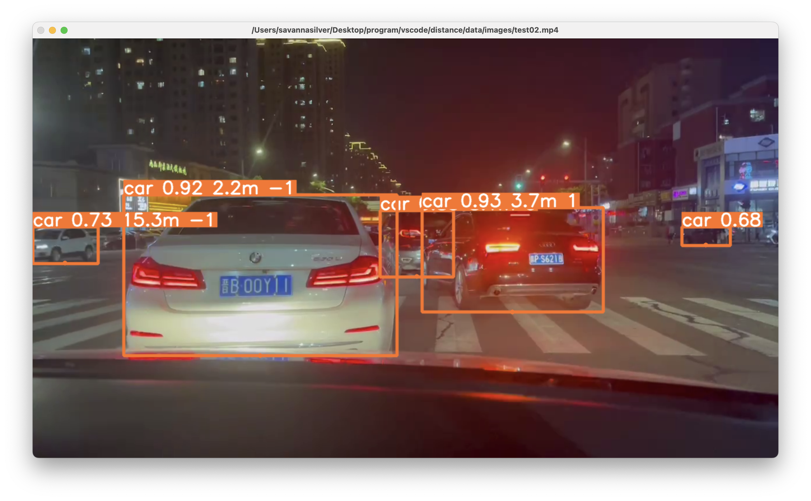

# Depth-Estimation-Based-On-YOLO

## Preview



## Usage

run code by this command

```
python estimate_distance.py --source <your video path> --view-img 
```


## Note

This project may not be precious.

# weight

The project is based on YOLO. However, the weight file is not uploaded, you need to download it by yourself.

[yolo](https://github.com/ultralytics/yolov5)

# camera parameters

As the project is about Monocular Depth Estimation, you need to adjust the camera parameters in `camera_parameters.xlsx` to fit your own camera. 
